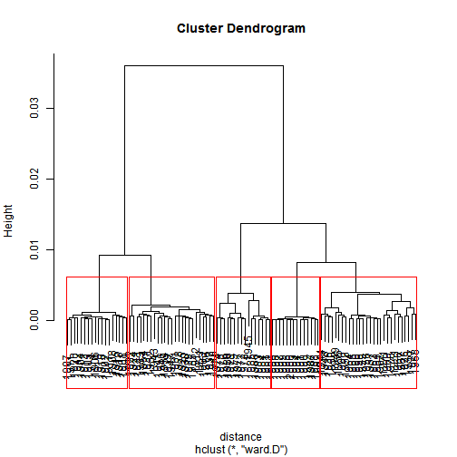
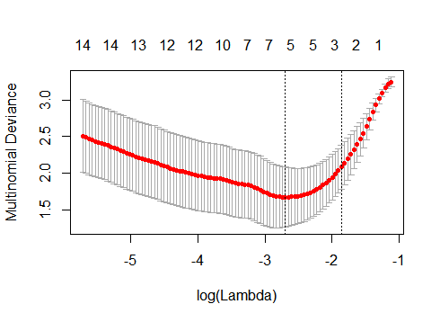
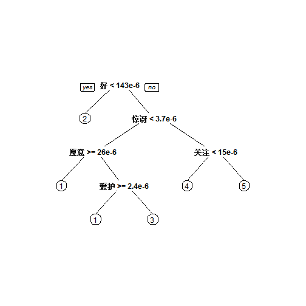

二十世纪中文图书中的情感变化
====================================================
to do:       
residual plot of negative and positive scores
   

 

两个消极情感的主要时间段（即标准化的总体情感分值小于零）为：          
1901年至1920年以及1969年至1985年，总体情感值在1975年前后达到底谷并随后逐年回升，该底谷对应于“文革”的结束             两个积极情感（即标准化的总体情感分值大于零）的主要时间段为：       
1921年至1968年以及1986年至2000年，总体情感值在1949年达到全局最高值，该峰值对应于新中国的成立。

      

    

聚集1主要包括1948年至1970年时间段，大致对应于新中国成立至文革期间。          
聚集2主要包括1900年至1920年时间段，大致对应于中国共产党成立以前。           
聚集3主要包括1921年至1947年时间段，大致对应于中国共产党成立至新中国成立。            
聚集4主要包括1971年至1985年时间段，大致对应与文革期间至改革开放初期。             
聚集5主要包括1986年至2000年时间段，大致对应于改革开放初期至20世纪末。             

                 
训练Lasso模型的也表示，5个词作Feature就足够好了。    

              
用分类树模型根据词频矩阵预测其所属聚集，发现只需要5个词即可知道年份,5个词为：    
好、惊讶、关注、愿意、爱护    

分析图的生成过程详情见 log.md .    
文章见writeup.doc           

Expression of Emotions in 20th Century Chinese Books 由 Ryan Cheung 创作，采用 知识共享 署名-非商业性使用-相同方式共享 4.0 国际 许可协议进行许可。     
基于https://github.com/ryancheunggit/Expression_of_Emotions_in_20th_Century_Chinese_Books/上的作品创作。
本许可协议授权之外的使用权限可以从 ryanzjlib@gmail.com 处获得。
